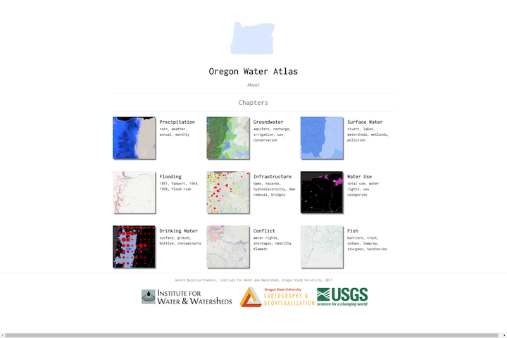
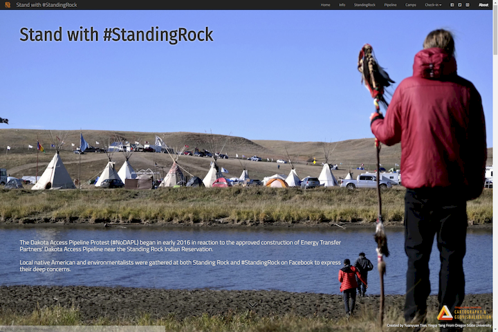
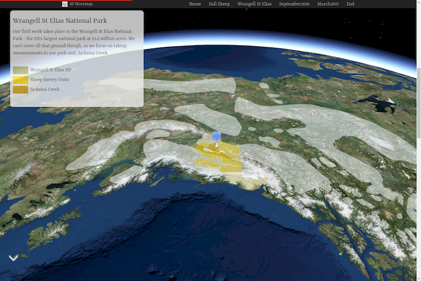
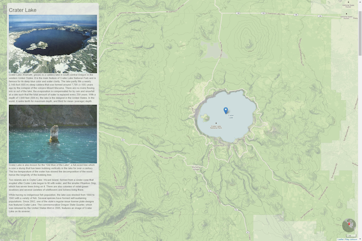
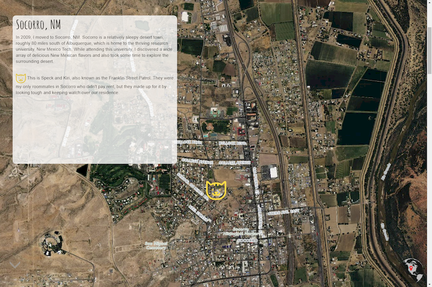
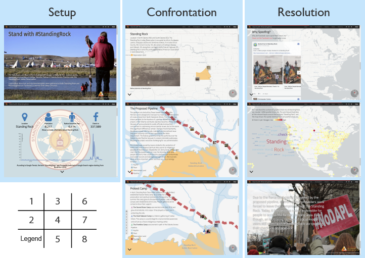

# Storymap

 ***[Storymap.js](https://github.com/jakobzhao/storymap)*** is a javascript library for storytelling with web maps. This library aims to enable individuals to effectively create story map applications over the Internet. Three major tasks would be dealt with, including web interface design, map design and storytelling structure. To develop these functions, this library is written in a combination of several web programming languages, like HTML, Cascading Style Sheets (CSS) and Javascript, and builds upon several prerequisite libraries and web services. To make the story map library robust and lightweight, we select as fewer prerequisite libraries as possible, and prioritize the use of open source or free libraries. This library is currently maintained by [Cartography and Geovisualization Group](http://geoviz.ceoas.oregonstate.edu) at Oregon State University, and has been used in multiple geovisualization related courses (e.g., GEOG 371: Web Mapping, GEOG 472/572: Geovisual Analytics) and projects. In addition, a lot of universities began to choose storymap.js instead of ESRI storymap platform, for example, 
such as [GEOG 678: Advanced Desktop Programming for GIS Customization offered by Eastern Michigan University](https://people.emich.edu/dbennion1/geog678/assignments/assignment8/).
 
A storymap is organically integrated by several scenes. Each scene consists of a web map and a script. You can manipulate the map by zooming, panning, and even adding more thematic layers. This library embodies the concept responsive web design, meaning the storymaps can be shown on either Desktop or mobile devices.

<p>Buy me a cup of coffee :coffee: :grinning: <a href="https://paypal.me/jakobzhao"></a> </p>


## Features

A story map consists of several scenes. Each scene has two basic components, in terms of the content object and the map object. The content object is usually made up by texts, graphics, and audios and videos. Here are some key features of this library.

1\. [Scene with fullscreen image or video](https://jakobzhao.github.io/storymap/examples/2.3/video.html)

2\. [MiniGlobe](https://jakobzhao.github.io/storymap/examples/2.3/video.html)

3\. [Nav Bar](https://jakobzhao.github.io/storymap/examples/2.3/navbar.html)

4\. [Map Symbolization](https://jakobzhao.github.io/storymap/examples/2.3/styles.html)

5\. [Tile Layers](https://jakobzhao.github.io/storymap/examples/2.3/tiles.html)

6\. [Data Interation](http://cdn.rawgit.com/jakobzhao/storymap/master/examples/dataInteraction/index.html)

7\. [Spinned loader,progress line, animated scroll-down arrow and more..](hhttps://jakobzhao.github.io/storymap/examples/2.3/video.html)

8\. [3D thematic map](https://cosgrovc.github.io/GEOG4572-PE1v2/index.html);

9\. [Bivariate color pallete generator](http://geoviz.ceoas.oregonstate.edu/storymap/color.html)

## Templates

1\. [Basic Template](https://jakobzhao.github.io/storymap/examples/2.3/helloworld.html);
2\. [Script panel on the right](https://jakobzhao.github.io/storymap/examples/2.3/right.html);
3\. [Split the screen in halves](https://jakobzhao.github.io/storymap/examples/2.3/split.html);
4\. [Atlas Front Page](https://jakobzhao.github.io/storymap/examples/2.3/atlas.html)
5\. [Fading out the scripts not being viewed](https://jakobzhao.github.io/storymap/examples/2.3/fadeout.html)
6\. [arrow lines](https://jakobzhao.github.io/storymap/examples/2.3/swoopy.html)

## Prerequisite

**Required**

1\. [jQuery](https://jquery.com/); 2\. [Bootstrap 3](http://getbootstrap.com/); 3\. [Leaflet](http://leafletjs.com/), (3d Storymap uses [Cesium](http://cesiumjs.org/) instead of leaflet).

**Recommended**

1\. Font Awesome; 2\. Animate; 3\. Google Font; 4\. Chroma.js; 5\. leaflet.ajax.min.js.

## Demos

1\. [Oregon Water Atlas](http://oregonwater.info/) -- made by *Garath Baldrica-franklin*



2\. [Stand With #StandingRock](https://winkyt.github.io/standwithstandingrock/) -- made by *Yuanyuan Tian and Yingqi Tang*



3\. [Alaskan MoutainSheep and 21st Century Snow](https://cosgrovc.github.io/GEOG4572-PE1v2/index.html) -- made by *Chris Cosgrove*



4\. [Sites in Oregon](https://cdn.rawgit.com/johnsoRiB/storymap_test/1800a77b/PE5/storymap-master/SightsInOregon.html) -- made by *Riley Johnson*




5\. [Stomping Grounds](http://geoviz.ceoas.oregonstate.edu/mathewsn-storymap/) -- made by *Nicolas Mathews*



## Tutorial

A story map is organized as a sequence of scenes, and the scenes are associated with maps. Each map are mashed up by layers, and the layers can be any types of layers that [leaflet.js](http://leafletjs.com/) or cesium support. Below shows the tree structure of this story map library.

```powershell
A Story Map
│
├───Scene 1: Setup
│      │──── Script 1 (e.g., text, video, image, audio, etc.)
│      │──── Map 1
│             │
│             │──── Layer 1
│             │──── Layer 2
│             │──── Layer N
├───Scene 2: Confrontation
│... ... ... ... ... ... ...
│... ... ... ... ... ... ...
│... ... ... ... ... ... ...
├───Scene N: Resolution
│      │──── Content 5
│      │──── Map 5
│             │
│             │──── Layer 1
│             │──── Layer 2
│             │──── Layer N
```

For example, Below is the storytelling structure of a storymap on the standingrock protest at North Dakota, you can see how this story map is organized to embody the setup, the confrontation and then the resolution. The storymap can be found at [here](https://winkyt.github.io/standwithstandingrock/).



Here, we will introduce how to make the [hello world](http://geoviz.ceoas.oregonstate.edu/storymap/examples/2.3/helloworld.html) story map application.

1\. Above all, create an empty html page.

```html
<!DOCTYPE html>
<html lang="en">
<head>
    <meta charset="UTF-8">
    <title>Hello World!</title>
</head>
<body>

</body>
</html>

```

2\. In the `head` element, please include all the required stylesheets and javascript,the `storymap` stylesheet and library. Please make sure to add stylesheets in front of the javascript libraries.

```html
<head>
    <title>Hello World</title>
    <meta charset="utf-8">
    <meta name="viewport" content="width=device-width, initial-scale=1">
    <!--add required stylesheets-->
    <!--make sure you add bootstrap 3.3.7 rather than 4.0.0-->
    <link rel="stylesheet" href="https://cdnjs.cloudflare.com/ajax/libs/twitter-bootstrap/3.3.7/css/bootstrap.min.css">
    <!--leaflet css-->
    <link rel="stylesheet" href="https://cdnjs.cloudflare.com/ajax/libs/leaflet/1.2.0/leaflet.css">
    <!--animation-->
    <link rel="stylesheet" href="https://cdnjs.cloudflare.com/ajax/libs/animate.css/3.5.2/animate.min.css">
    <!--Google Font-->
    <link href="https://fonts.googleapis.com/css?family=Cairo" rel="stylesheet">
    <link rel="stylesheet" type="text/css" href="../../dist/storymap.2.3.css">

    <!--add required libraries-->
    <!--leaflet-->
    <script src="https://cdnjs.cloudflare.com/ajax/libs/leaflet/1.2.0/leaflet.js"></script>
    <!--jquery-->
    <script src="https://cdnjs.cloudflare.com/ajax/libs/jquery/3.2.1/jquery.min.js"></script>
    <!--boostrap-->
    <script src="https://cdnjs.cloudflare.com/ajax/libs/twitter-bootstrap/3.3.7/js/bootstrap.min.js"></script>
    <!--leaflet.ajax for asynchronously adding geojson data-->
    <script src="https://cdnjs.cloudflare.com/ajax/libs/leaflet-ajax/2.1.0/leaflet.ajax.min.js"></script>
    <!--story map plugin-->
    <script src="../../dist/storymap.2.3.js"></script>
</head>
```

To use this storymap library, two files `storymap.2.3.css` and `storymap.2.3.js` are requried to include. Also, this library can be included by download instead of include the source at this repository.

Check [`storymap.2.3.css`](https://raw.githubusercontent.com/jakobzhao/storymap/master/dist/storymap.2.3.css) and [`storymap.2.3.js`](https://raw.githubusercontent.com/jakobzhao/storymap/master/dist/storymap.2.3.js) to download.

3\. Next, in the `body` element, please create a `div` to contain an `storymap` instance.

```html
<body>
<div id="storymap" class="container-fluid" >
    <div class="row">
        <div class="col-sm-6 col-md-8 storymap-map"></div>
        <div class="col-sm-6 col-md-4 storymap-story"></div>
    </div>
</div>
</body>
```

A storymap consists of two key components, namely a map and a story, please put two divs in a `row` div under the container of `storymap`. Please make sure to append class `storymap-map` and `storymap-story` for each div respectively.

4\. Several scenes are contained in a `storymap-story` div. Each scene is held by a `section` element, and assign a `data-scene` attribute. This attribute will be used to link the `section` element to the map component.

```html
<section data-scene="scene1">
    ...
</section>
<section data-scene="scene2">
    ...
</section>
<section data-scene="scene3">
    ...
</section>
```

5\. Each scene holds the content of the scene. various types of multi-media data can be put in the `section` element.

```html
<section data-scene="scene1">
    <h2>scene 1</h2>
</section>
```

6\. For example, if the `data-scene` parameter is `scene1`, the name of the corresponding map object should be scene1` as well. In the layer array object, you will need to include the layer names. For example, layer1, layer2. These layers need to be defined before the scenes object. The `scenes` object can be defined in the script as:

```js
var scenes = {
    scene1: {lat: 44.0563432, lng: -123.5099875, zoom: 7, layers: ['layer2'], name: "scene 1"},
    scene2: {lat: 44.5701158, lng: -123.2949388, zoom: 10, layers: ['layer2'], name: "scene 2"},
    scene3: {lat: 44.5701158, lng: -123.2949388, zoom: 12, layers: ['layer1', 'layer2'], name: "scene 3"}
};
```

Here is the `layers` array:

```js
var layers = {
    layer1: {
        layer: L.tileLayer('http://server.arcgisonline.com/ArcGIS/rest/services/World_Imagery/MapServer/tile/{z}/{y}/{x}'),
        legend: '<i style="background: black; opacity: 0.5"></i><p><b>legend 1</b></p>'
    },
    layer2: {
        layer: L.geoJson.ajax('http://mapious.ceoas.oregonstate.edu/geoserver/mapious/ows?service=WFS&version=1.0.0&request=GetFeature&typeName=ore_counties&outputFormat=application%2Fjson', {
            color: 'orange',
            weight: 5
        }),
        legend: '<i style="background: orange; opacity: 0.5"></i><p><b>legend 2</b></p>'
    },
    layer3: {
        layer: L.tileLayer('http://cartodb-basemaps-{s}.global.ssl.fastly.net/light_all/{z}/{x}/{y}.png')
    }
};
```

A storymap has an array of scenes and a scene has an array of layers. The `scene` and `layer` is defined as below.

```js
scene = {
    lat: `float number`,  // the latitude of the center point of the scene.
    lng: `float number`,  // the longitude of the center point of the scene.
    zoom: `integer`,      // the zooming levelr of the map scene.
    layers: `array`,      // the array of layers to add on.
    name: `string`        // the name of the scence This name will be used in the navwidget and/or navbar if any
}
```

```js
layer = {
    layer: `Leaflet Layer`,
    legend: `A legend patch html`
}
```

7\. After defining the layers and scenes, you will create a `storymap` object to anchor to the `storymap` div. We can capture that div using $ selector, Here, the selector is `$('#storymap')`.

```js
$('#storymap').storymap({
    scenes: scenes,
    layers: layers,
    baselayer: layers.layer3,
    legend: true,
    loader: true,
    flyto: false,
    credits: "build with<i class='glyphicon glyphicon-heart' style='color: red'></i> from Bo Zhao",
    scalebar: true,
    scrolldown: true,
    progressline: true,
    navwidget: true,
    createMap: function () {
        var map = L.map($(".storymap-map")[0], {zoomControl: false}).setView([44, -120], 7);
        basemap = this.baselayer.layer.addTo(map);
        return map;
    }
});
```

>**Note:** To make a storymap, the `scenes` and `layers` objects are required. Other options are optional. By default, the library sets the `breakpoint` **`33%`** from the top of the page, Besides, you can customize your map in the `createMap` function.

Here is the data structure of storymap object.

```js
$(element).storymap({
    triggerpos: `a string of percentage`, // A percentage string'33.333%',
    scenes: `an array of scene objects`,
    layers: `an array of layer objects`,
    baselayer: `a layer`,
    legend: `Boolean value`,
    loader: `Boolean value`,
    flyto: `Boolean value`,
    credits: `html content`,
    scalebar: `Boolean value`,
    scrolldown: `Boolean value`,
    progressline: `Boolean value`,
    navwidget: `Boolean value`,
    createMap: function () {}
});
```

8\. To add a geojson data, you will need to include the `leaflet.ajax.min.js` library in the `head` element. As shown below.

```html
<!--add ajax based data transmission-->
<script src="https://cdnjs.cloudflare.com/ajax/libs/leaflet-ajax/2.1.0/leaflet.ajax.min.js"></script>
```

Till now, in the `script` of the `body` element, you have the following code snippet.

```javascript
<script type="text/javascript">

    var layers = {
        layer1: {
            layer: L.tileLayer('http://server.arcgisonline.com/ArcGIS/rest/services/World_Imagery/MapServer/tile/{z}/{y}/{x}'),
            legend: '<i style="background: black; opacity: 0.5"></i><p><b>legend 1</b></p>'
        },
        layer2: {
            layer: L.geoJson.ajax('http://mapious.ceoas.oregonstate.edu/geoserver/mapious/ows?service=WFS&version=1.0.0&request=GetFeature&typeName=ore_counties&outputFormat=application%2Fjson', {
                color: 'orange',
                weight: 5
            }),
            legend: '<i style="background: orange; opacity: 0.5"></i><p><b>legend 2</b></p>'
        },
        layer3: {
            layer: L.tileLayer('http://cartodb-basemaps-{s}.global.ssl.fastly.net/light_all/{z}/{x}/{y}.png')
        }
    };

    var scenes = {
        scene1: {lat: 44.0563432, lng: -123.5099875, zoom: 7, layers: ['layer2'], name: "scene 1"},
        scene2: {lat: 44.5701158, lng: -123.2949388, zoom: 10, layers: ['layer2'], name: "scene 2"},
        scene3: {lat: 44.5701158, lng: -123.2949388, zoom: 12, layers: ['layer1', 'layer2'], name: "scene 3"}
    };

    $('#storymap').storymap({
        scenes: scenes,
        layers: layers,
        baselayer: layers.layer3,
        legend: true,
        loader: true,
        flyto: false,
        credits: "build with<i class='glyphicon glyphicon-heart' style='color: red'></i> from Bo Zhao",
        scalebar: true,
        scrolldown: false,
        progressline: true,
        navwidget: true,
        createMap: function () {
            var map = L.map($(".storymap-map")[0], {zoomControl: false}).setView([44, -120], 7);
            basemap = this.baselayer.layer.addTo(map);
            return map;
        }
    });
</script>
```

Okay, now we have walk through how to make a simple storymap. See the full source code at [here](https://github.com/jakobzhao/storymap/blob/master/examples/2.3/helloworld.html), and look at this `hello world` application by clicking [here](http://geoviz.ceoas.oregonstate.edu/storymap/examples/2.3/helloworld.html).


## Team

Storymap is currently maintained by the [Cartography and Geovisualization group](geoviz.ceoas.oregonstate.edu) at Oregon State University.


- **[Bo Zhao](https://ceoas.oregonstate.edu/profile/zhao/)** (Project Leader)

- **[Gareth Baldrica-franklin](https://github.com/cartobaldrica)**

## License

This storymap map library is under [the MIT license](LICENSE).
