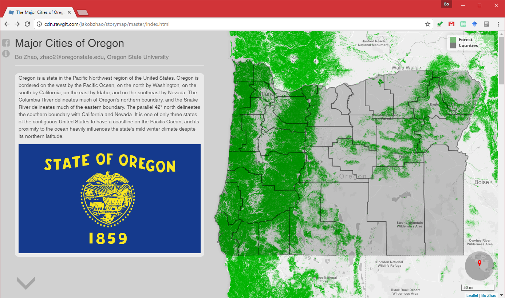
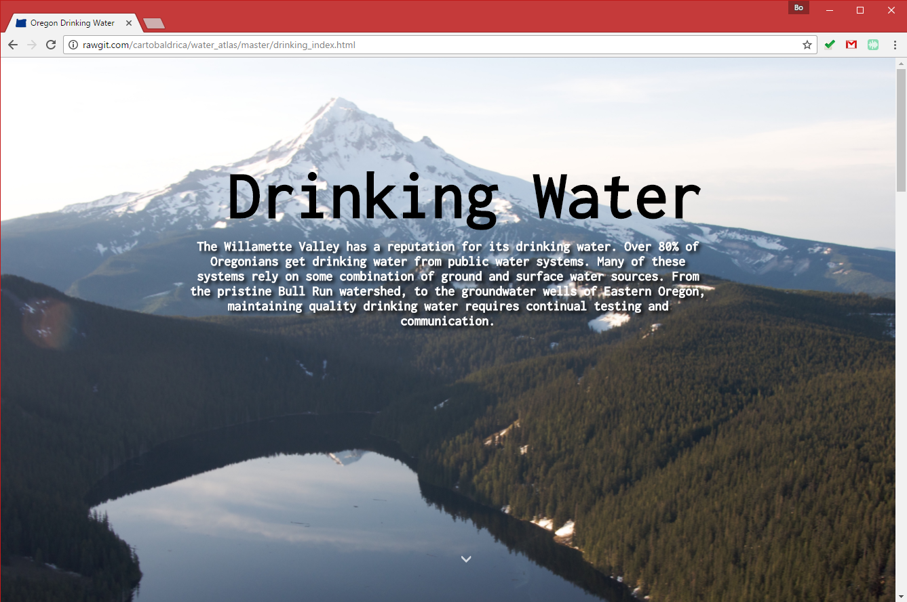
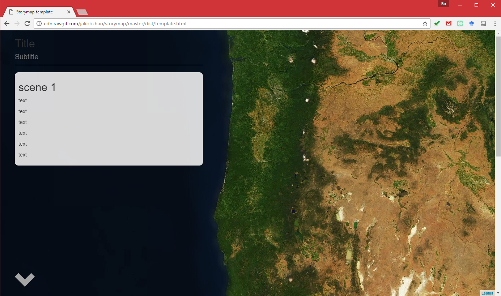

# Storymap

Storymap.js is a javascript map library to tell a story using web maps. Using this library, you can create a map that follows a storyline. For each paragraph, you can place a map alongside it, and manipulate the map by zooming, panning, and even adding more thematic layers. This map library follows the concept **responsive design**, meaning the stories can be shown on any Desktop or mobile devices. This library is initially developed for the use of the course **GEOG 371 Geovisualization: Web Mapping** at Oregon State University.


The new version supports:

* **3D thematic map** [a preview](http://rawgit.com/jakobzhao/storymap/master/examples/3d/index.html);
* add video as background;
* animated arrow-down icon; and
* add a navigation bar on the left of the browser view.

## Demo

See demos at

- [Cities of Oregon v.2.1.11](http://cdn.rawgit.com/jakobzhao/storymap/master/examples/video/index.html)




- [Symbolization](http://jakobzhao.github.io/storymap/examples/symbolization/index.html)


- [Oregon Drink Water](http://rawgit.com/cartobaldrica/water_atlas/master/drinking_index.html) -  made by [cartobaldrica](https://github.com/cartobaldrica)



- [Story Map Template](http://cdn.rawgit.com/jakobzhao/storymap/master/examples/helloWorld/index.html)



## Requirements

Storymap depends on some common javascript libraries, including:

- [jQuery](https://jquery.com/)
- [Leaflet](http://leafletjs.com/)
- [Bootstrap 3](http://getbootstrap.com/)

## Usage

In this section, we will walk through the process of making a basic storymap. You can browse the application at [http://rawgit.com/jakobzhao/storymap/master/examples/helloWorld/index.html](http://rawgit.com/jakobzhao/storymap/master/examples/helloWorld/index.html). Above all, you need to include some prerequisite stylesheets and javascript libraries in the head tag.

```html
<!DOCTYPE html>
<html lang="en">
<head>
    <title>Hello World</title>
    <meta charset="utf-8">
    <meta name="viewport" content="width=device-width, initial-scale=1" />
  	<!--add required stylesheets-->
    <link rel="stylesheet" href="https://maxcdn.bootstrapcdn.com/bootstrap/3.3.7/css/bootstrap.min.css">
    <link rel="stylesheet" href="https://unpkg.com/leaflet@1.0.2/dist/leaflet.css" />
  	<!--animation-->
    <link rel="stylesheet" href="https://cdnjs.cloudflare.com/ajax/libs/animate.css/3.5.2/animate.min.css">
  
    <!--add required libraries-->
    <script src="https://unpkg.com/leaflet@1.0.2/dist/leaflet.js"></script>
    <script src="https://ajax.googleapis.com/ajax/libs/jquery/3.1.1/jquery.min.js"></script>
    <script src="https://maxcdn.bootstrapcdn.com/bootstrap/3.3.7/js/bootstrap.min.js"></script>
</head>
```

To use this storymap library, you need to download all the three files in the `dist` folder, which includes a stylesheet - `storymap.css`, a javascript library - `storymap.js`. you can build up your Storymap via the **hello world** example under the example folder.

```html
<head>
   <!--storymap stylesheet -->
    <link rel="stylesheet" type="text/css" href="../../dist/storymap.css">
    <!--story map library-->
    <script src="../../dist/storymap.js"></script>
</head>
```

Once including these necessary libraries and stylesheets, you will need to create a bootstrap container `div` to hold the contents and the concomitant maps. To make the contents and maps side by side, you need to put both the content `div` and the **map** `div` within a **row** `div`. the **main** class applies for the content `div`, and the **sidebar** class applies for the **map** `div`.

```html
<div class="container-fluid">
    <div class="row">
        <div class="col-sm-6 col-md-4 main">
            <section data-scene="scene1">
            </section>
            <section data-scene="scene2">
            </section>
            <section data-scene="scene3">
            </section>
        </div>
        <div id="map" class="col-sm-6 col-md-8 sidebar"></div>
    </div>
</div>
```

If you want to activate the navigation bar and the scrolling down arrow, you will need to add two elements in the container `div`. See the code below.

```html
<div class="container-fluid">
    <div class="row">
        <div class="... main">
        </div>
        <div id="map" class="... sidebar"></div>
    </div>
    <!--add a scrolling down arrow-->
    <div class="animated zoomIn infinite glyphicon glyphicon-menu-down arrow-down"></div>
    <!--add a navigation bar-->
    <div class="navbar text-center"></div>
</div>
```

A story map consists of several scenes. Each scene has two basic components, in terms of the content object and the map object. The content object is usually made up by texts, graphics, and audios and videos. You can take advantage of the `html5` to put various types of multi-media data within a `section` tag. A content object is associated with a map object. To link the content and the map, you simply use the `data-scene` parameter of the `section` tag to name the map.  For example, if the `data-scene` parameter is ***scene1***, the name of the corresponding map object should be ***scene1*** as well. the ***scene1*** map can be defined in the script as:

```javascript
scene1: {lat: 44, lng: -123.5, zoom: 7, layers: ['layer 1'], name: "scene 1"},
```

One of the major differences between the original story map plugin and this enhanced version is that the improvements in embodying the logics of storyline. As noted, a story map is organized as a sequence of scenes, and the scenes are associated with maps. Each map are mashed up by layers, and the layers can be any types of layers that [leaflet.js](http://leafletjs.com/) support.  Below shows the tree structure of this story map plugin.

```powershell
A Story Map
│
├───Scene 1: Exposition
│      │──── Content 1
│      │──── Map 1
│             │
│             │──── Layer 1
│             │──── Layer 2
│             │──── Layer N
├───Scene 2: Conflict
│      │──── Content 2
│      │──── Map 2
│             │
│             │──── Layer 1
│             │──── Layer 2
│             │──── Layer N
├───Scene 3: Rising action
│      │──── Content 3
│      │──── Map 3
│             │
│             │──── Layer 1
│             │──── Layer 2
│             │──── Layer N
├───Scene 4: Climax
│      │──── Content 4
│      │──── Map 4
│             │
│             │──── Layer 1
│             │──── Layer 2
│             │──── Layer N
├───Scene N: Falling action and Resolution
│      │──── Content 5
│      │──── Map 5
│             │
│             │──── Layer 1
│             │──── Layer 2
│             │──── Layer N
```

To script a story map, you need to define a storymap object as below:

```javascript
element.storymap({
  	scenes: scene-objects,
  	layers: layer-objects,
    selector: '[data-scene]',
    breakpointPos: '33.333%',
    legend: false, // the legend is invisible, if the legend parameter is false.
    createMap: function () {
      var map = L.map('map', {zoomControl: false}).setView([44, -120], 7);
      L.tileLayer('https://api.tiles.mapbox.com/v4/{id}/{z}/{x}/{y}.png?access_token=pk.eyJ1IjoiamFrb2J6aGFvIiwiYSI6ImNpcms2YWsyMzAwMmtmbG5icTFxZ3ZkdncifQ.P9MBej1xacybKcDN_jehvw', {
        maxZoom: 18,
        attribution: '',
        id: 'mapbox.light'
      }).addTo(map);
      return map;
    }
})
```

The **element** object is the `div` you wish to add a storymap to. If you create the content `div`with a **main** class, then you can bind the storymap to the content `div` by the following line:

```javascript
$('.main').storymap({...});
```

By default, the library looks for elements that has a `data-scene` attribute, sets the `breakpoint` **`33%`** from the top of the page, the **legend** of the map is invisible.  You can always override this options and also modify the default **createMap** function.

All the scenes are declared in a single object named as `scenes`. For example:

```javascript
var scenes = {
  scene1: {lat: 44, lng: -123.5, zoom: 7, layers: ['layer 1']},
  scene2: {lat: 44.5701158, lng: -123.2949388, zoom: 14, layers: ['layer 2']},
  scene3: {lat: 45.5186089, lng: -122.7270297, zoom: 11, layers: ['layer 1', 'layer 2']}
};
```

In the above example, I declared the `scenes` object, and it contains three scenes, in terms `scene1`, `scene2`, and `scene3`.  For each scene, it will contain several parameters. the latitude, longitude of the center of the map, and zoom level of the map. Also, the `layers` parameter indicates what are the thematic layers for the given scene. For example, `scene1` has only one thematic layer `layer 1`, `scene2` has one thematic layer as well, and `scene3` has two, in terms of `layer 1` and `layer 2`.

For the layers, they are also defined in an single object.  Each layer is an array containing two variables, the first variable is the layer itself, which can be any types of layer which leaflet supports, the second variable is the legend content, which is written in html. The layers object format is.

```javascript
var layers = {
  'layer 1': [layer_object_1, legend_1],
  'layer 2': [layer_object_2, legend_2],
  ... ...
  'layer n': [layer_object_n, legend_n]
}
```

Regarding the template, below is a `layers` object containing two different layers.

```javascript
var layers = {
        'layer 1': [ L.tileLayer('https://api.tiles.mapbox.com/v4/{id}/{z}/{x}/{y}.png?access_token=pk.eyJ1IjoiamFrb2J6aGFvIiwiYSI6ImNpcms2YWsyMzAwMmtmbG5icTFxZ3ZkdncifQ.P9MBej1xacybKcDN_jehvw', {id: 'mapbox.satellite'}), '<i style="background: black; opacity: 0.5"></i><p><b>legend 1</b></p>'],
        'layer 2': [ L.geoJson.ajax('http://mapious.ceoas.oregonstate.edu/geoserver/ceoas/ows?service=WFS&version=1.0.0&request=GetFeature&typeName=ceoas:admin&outputFormat=application%2Fjson', {color: 'orange', weight: 5}), '<i style="background: orange; opacity: 0.5"></i><p><b>legend 2</b></p>']
    };
```

Here, `layer 1` is a mapbox tileLayer and `layer 2` is a geojson layer.

> **Note**: To use the **geoJson.ajax** plugin, you will need to include the `leaflet.ajax.min.js` library in the head tag. As shown below.

```html
<!--add ajax based data transmission-->
<script src="https://cdnjs.cloudflare.com/ajax/libs/leaflet-ajax/2.1.0/leaflet.ajax.min.js"></script>
```

Till now, you will have the code block like below.

```javascript
var layers = {
  'layer 1': [ L.tileLayer('https://api.tiles.mapbox.com/v4/{id}/{z}/{x}/{y}.png?access_token=pk.eyJ1IjoiamFrb2J6aGFvIiwiYSI6ImNpcms2YWsyMzAwMmtmbG5icTFxZ3ZkdncifQ.P9MBej1xacybKcDN_jehvw', {id: 'mapbox.satellite'}), '<i style="background: black; opacity: 0.5"></i><p><b>legend 1</b></p>'],
  'layer 2': [ L.geoJson.ajax('http://mapious.ceoas.oregonstate.edu/geoserver/ceoas/ows?service=WFS&version=1.0.0&request=GetFeature&typeName=ceoas:admin&outputFormat=application%2Fjson', {color: 'orange', weight: 5}), '<i style="background: orange; opacity: 0.5"></i><p><b>legend 2</b></p>']
};

var scenes = {
  scene1: {lat: 44, lng: -123.5, zoom: 7, layers: ['layer 1']},
  scene2: {lat: 44.5701158, lng: -123.2949388, zoom: 14, layers: ['layer 2']},
  scene3: {lat: 44.5701158, lng: -123.2949388, zoom: 12, layers: ['layer 1', 'layer 2']}
};

$('.main').storymap({
  scenes: scenes,
  layers: layers,
  legend: true,
  scale: true,
  navbar: true,
  createMap: function () {
    var map = L.map('map', {zoomControl: false}).setView([44, -120], 7);
    L.tileLayer('https://api.tiles.mapbox.com/v4/{id}/{z}/{x}/{y}.png?access_token=pk.eyJ1IjoiamFrb2J6aGFvIiwiYSI6ImNpcms2YWsyMzAwMmtmbG5icTFxZ3ZkdncifQ.P9MBej1xacybKcDN_jehvw', {
      maxZoom: 18,
      attribution: '',
      id: 'mapbox.light'
    }).addTo(map);
    return map;
  }
});
```

In order to see how the code works, you can see the application (as well as the code) of the story map at [Hello World Example](http://rawgit.com/jakobzhao/storymap/master/examples/helloWorld/index.html).


## License
This storymap map library is under the MIT license, and currently maintained by [Bo Zhao](http://ceoas.oregonstate.edu/profile/zhao/) from  the cartography group at Oregon State University.