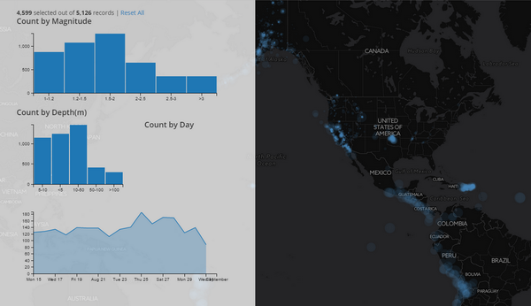

# Storymap

 ***[Storymap.js](https://github.com/jakobzhao/storymap)*** is a javascript library for storytelling with web maps. This library aims to enable individuals to effectively create story map applications over the Internet. Three major tasks would be dealt with, including web interface design, map design and storytelling structure. To develop these functions, this library is written in a combination of several web programming languages in terms of HTML, Cascading Style Sheets (CSS) and Javascript, and builds upon several prerequisite libraries and web services. To make the story map library robust and lightweight, we select as fewer prerequisite libraries as possible, and prioritize the use of open source or free libraries. This library is currently maintained by [Cartography and Geovisualization Group](http://geoviz.ceoas.oregonstate.edu) aat Oregon State University, and has been used in multiple geovisualization related courses (e.g., GEOG 371: Web Mapping, GEOG 4/572: Geovisual Analytics).

A storymap is organically integrated by several scenes. Each scene consists of a web map and a script. You can manipulate the map by zooming, panning, and even adding more thematic layers. This library embodies the concept responsive web design, meaning the storymaps can be shown on any Desktop or mobile devices.

A story map consists of several scenes. Each scene has two basic components, in terms of the content object and the map object. The content object is usually made up by texts, graphics, and audios and videos.

**The latest version supports:**

* add a spinned loader.
* add a progress line;
* add nav bar on the top;
* support 3d thematic map;
* add video or image as background;
* animated scroll-down arrow;
* arrow-down icon; and
* several templates.

## Prerequisite

### Required

- [jQuery](https://jquery.com/)
- [Bootstrap 3](http://getbootstrap.com/)
- [Leaflet](http://leafletjs.com/)

> **Note:** The 3d Storymap uses [Cesium](http://cesiumjs.org/) instead of leaflet.

### Recommended

* Font Awesome
* Animate
* Google Font
* Chroma.js
* leaflet.ajax.min.js

A story map is organized as a sequence of scenes, and the scenes are associated with maps. Each map are mashed up by layers, and the layers can be any types of layers that [leaflet.js](http://leafletjs.com/) support.  Below shows the tree structure of this story map plugin.

```powershell
A Story Map
│
├───Scene 1: Exposition
│      │──── Script 1 (e.g., text, video, image, audio, etc.)
│      │──── Map 1
│             │
│             │──── Layer 1
│             │──── Layer 2
│             │──── Layer N
├───Scene 2: Conflict
├───Scene 3: Rising action
├───Scene 4: Climax
│... ... ... ... ... ... ...
│... ... ... ... ... ... ...
│... ... ... ... ... ... ...
├───Scene N: Falling action and Resolution
│      │──── Content 5
│      │──── Map 5
│             │
│             │──── Layer 1
│             │──── Layer 2
│             │──── Layer N
```

## Tutorial

In this section, we will introduce how to make the `[hello world](http://geoviz.ceoas.oregonstate.edu/storymap/examples/2.3/helloworld.html)` story map application.

1\. Above all, create an empty html page.

```html
<!DOCTYPE html>
<html lang="en">
<head>
    <meta charset="UTF-8">
    <title>Hello World!</title>
</head>
<body>

</body>
</html>

```

2\. In the `head` element, please include all the required stylesheets and javascript, and the `storymap` stylesheet and library. Please make sure you add stylesheets in front of the javascript libraries.

```html
<head>
    <title>Hello World</title>
    <meta charset="utf-8">
    <meta name="viewport" content="width=device-width, initial-scale=1">
    <!--add required stylesheets-->
    <!--make sure you add bootstrap 3.3.7 rather than 4.0.0-->
    <link rel="stylesheet" href="https://cdnjs.cloudflare.com/ajax/libs/twitter-bootstrap/3.3.7/css/bootstrap.min.css">
    <!--leaflet css-->
    <link rel="stylesheet" href="https://cdnjs.cloudflare.com/ajax/libs/leaflet/1.2.0/leaflet.css">
    <!--animation-->
    <link rel="stylesheet" href="https://cdnjs.cloudflare.com/ajax/libs/animate.css/3.5.2/animate.min.css">
    <!--Google Font-->
    <link href="https://fonts.googleapis.com/css?family=Cairo" rel="stylesheet">
    <link rel="stylesheet" type="text/css" href="../../dist/storymap.2.3.css">

    <!--add required libraries-->
    <!--leaflet-->
    <script src="https://cdnjs.cloudflare.com/ajax/libs/leaflet/1.2.0/leaflet.js"></script>
    <!--jquery-->
    <script src="https://cdnjs.cloudflare.com/ajax/libs/jquery/3.2.1/jquery.min.js"></script>
    <!--boostrap-->
    <script src="https://cdnjs.cloudflare.com/ajax/libs/twitter-bootstrap/3.3.7/js/bootstrap.min.js"></script>
    <!--leaflet.ajax for asynchronously adding geojson data-->
    <script src="https://cdnjs.cloudflare.com/ajax/libs/leaflet-ajax/2.1.0/leaflet.ajax.min.js"></script>
    <!--story map plugin-->
    <script src="../../dist/storymap.2.3.js"></script>
</head>
```

To use this storymap library, you need to include two files `storymap.2.3.css` and `storymap.2.3.js`. Also, you can download and put them in your project folder.

Check [`storymap.2.3.css`](dist/storymap.2.3.css) and [`storymap.2.3.js`](dist/storymap.2.3.js) to download.

3\. Next, in the `body` element, please create a `div` for holding an `storymap` instance.

```html
<body>
<div id="storymap" class="container-fluid" >
    <div class="row">
        <div class="col-sm-6 col-md-8 storymap-map"></div>
        <div class="col-sm-6 col-md-4 storymap-story"></div>
    </div>
</div>
</body>
```

A storymap consists of two key components, namely a map and a story, please put two divs in a `row` div under the container of `storymap` div. Please make sure you will append class `storymap-map` and `storymap-story` for one div respectively.

4\. In the `storymap-story` div, please put several scenes. Each scene is held by a `section` element, and you need to assign a `data-scene` attribute to the scene. This attribute will be used to link the `section` element to the map component.

```html
<section data-scene="scene1">
    ...
</section>
<section data-scene="scene2">
    ...
</section>
<section data-scene="scene3">
    ...
</section>
```

5\. In each scene, you can put the content of the scene. You can take advantage of the `html5` to put various types of multi-media data within a `section` tag. For example, I put a header in the following scene.

```html
<section data-scene="scene1">
    <h2>scene 1</h2>
</section>
```

6\. For example, if the `data-scene` parameter is ***scene1***, the name of the corresponding map object should be ***scene1*** as well. the ***scene1*** map can be defined in the script as:

```js
var scenes = {
    scene1: {lat: 44, lng: -123.5, zoom: 7, layers: ['layer2'], name: "scene 1"},
    scene2: {lat: 44.5701158, lng: -123.2949388, zoom: 10, layers: ['layer2'], name: "scene 2"},
    scene3: {lat: 44.5701158, lng: -123.2949388, zoom: 12, layers: ['layer1', 'layer2'], name: "scene 3"}
};
```

In the layer array object, you will need to include the layer names. For example, layer1, layer2. These layers need to be defined before the scenes object.

```js
var layers = {
    layer1: {
        layer: L.tileLayer('http://server.arcgisonline.com/ArcGIS/rest/services/World_Imagery/MapServer/tile/{z}/{y}/{x}'),
        legend: '<i style="background: black; opacity: 0.5"></i><p><b>legend 1</b></p>'
    },
    layer2: {
        layer: L.geoJson.ajax('http://mapious.ceoas.oregonstate.edu/geoserver/mapious/ows?service=WFS&version=1.0.0&request=GetFeature&typeName=ore_counties&outputFormat=application%2Fjson', {
            color: 'orange',
            weight: 5
        }),
        legend: '<i style="background: orange; opacity: 0.5"></i><p><b>legend 2</b></p>'
    },
    layer3: {
        layer: L.tileLayer('http://cartodb-basemaps-{s}.global.ssl.fastly.net/light_all/{z}/{x}/{y}.png')
    }
};
```

A storymap has an array of scenes and a scene has an array of layers. The `scene` and `layer` is defined as below.

```
scene = {
    lat: `float number`,  // the latitude of the center point of the scene.
    lng: `float number`,  // the longitude of the center point of the scene.
    zoom: `integer`,      // the zooming levelr of the map scene.
    layers: `array`,      // the array of layers to add on.
    name: `string`        // the name of the scence This name will be used in the navwidget and/or navbar if any
}
```

```layer
layer = {
    layer: `Leaflet Layer`,
    legend: `A legend patch html`
}
```

7\. After defining the layers and scenes, you will create a `storymap` object to anchor to the `storymap` div. Since the `id` of `storymap` div is `storyamp`, we can capture that div using $ selector, such as `$('#storymap')`.

```
$('#storymap').storymap({
    scenes: scenes,
    layers: layers,
    baselayer: layers.layer3,
    legend: true,
    loader: true,
    flyto: false,
    credits: "build with<i class='glyphicon glyphicon-heart' style='color: red'></i> from Bo Zhao",
    scalebar: true,
    scrolldown: true,
    progressline: true,
    navwidget: true,
    createMap: function () {
        var map = L.map($(".storymap-map")[0], {zoomControl: false}).setView([44, -120], 7);
        basemap = this.baselayer.layer.addTo(map);
        return map;
    }
});
```

>**Note:** To make a storymap, the `scenes` and `layers` objects are required. Other options are optional. By default, the library sets the `breakpoint` **`33%`** from the top of the page, Besides, you can customize your map in the `createMap` function.

Here is the data structure of storymap object.

```
$(element).storymap({
    breakpointPos: `a string of percentage`, // A percentage string'33.333%',
    scenes: `an array of scene objects`,
    layers: `an array of layer objects`,
    baselayer: `a layer`,
    legend: `Boolean value`,
    loader: `Boolean value`,
    flyto: `Boolean value`,
    credits: `html content`,
    scalebar: `Boolean value`,
    scrolldown: `Boolean value`,
    progressline: `Boolean value`,
    navwidget: `Boolean value`,
    createMap: function () {}
});
```

8\. To add a geojson data, you will need to include the `leaflet.ajax.min.js` library in the `head` element. As shown below.

```html
<!--add ajax based data transmission-->
<script src="https://cdnjs.cloudflare.com/ajax/libs/leaflet-ajax/2.1.0/leaflet.ajax.min.js"></script>
```

Till now, in the `script` of the `body` element, you have the following code snippet.

```javascript
<script type="text/javascript">

    var layers = {
        layer1: {
            layer: L.tileLayer('http://server.arcgisonline.com/ArcGIS/rest/services/World_Imagery/MapServer/tile/{z}/{y}/{x}'),
            legend: '<i style="background: black; opacity: 0.5"></i><p><b>legend 1</b></p>'
        },
        layer2: {
            layer: L.geoJson.ajax('http://mapious.ceoas.oregonstate.edu/geoserver/mapious/ows?service=WFS&version=1.0.0&request=GetFeature&typeName=ore_counties&outputFormat=application%2Fjson', {
                color: 'orange',
                weight: 5
            }),
            legend: '<i style="background: orange; opacity: 0.5"></i><p><b>legend 2</b></p>'
        },
        layer3: {
            layer: L.tileLayer('http://cartodb-basemaps-{s}.global.ssl.fastly.net/light_all/{z}/{x}/{y}.png')
        }
    };

    var scenes = {
        scene1: {lat: 44, lng: -123.5, zoom: 7, layers: ['layer2'], name: "scene 1"},
        scene2: {lat: 44.5701158, lng: -123.2949388, zoom: 10, layers: ['layer2'], name: "scene 2"},
        scene3: {lat: 44.5701158, lng: -123.2949388, zoom: 12, layers: ['layer1', 'layer2'], name: "scene 3"}
    };

    $('#storymap').storymap({
        scenes: scenes,
        layers: layers,
        baselayer: layers.layer3,
        legend: true,
        loader: true,
        flyto: false,
        credits: "build with<i class='glyphicon glyphicon-heart' style='color: red'></i> from Bo Zhao",
        scalebar: true,
        scrolldown: false,
        progressline: true,
        navwidget: true,
        createMap: function () {
            var map = L.map($(".storymap-map")[0], {zoomControl: false}).setView([44, -120], 7);
            basemap = this.baselayer.layer.addTo(map);
            return map;
        }
    });
</script>
```

Okay, now we have walk through how to make a simple storymap. look at this `hello world` application by clicking [here](http://geoviz.ceoas.oregonstate.edu/storymap/examples/2.3/helloworld.html).

## Demo

- [Fullpage video or images](http://cdn.rawgit.com/jakobzhao/storymap/master/examples/video/index.html)


- [Symbolization](http://jakobzhao.github.io/storymap/examples/symbolization/index.html)


- [TileLayers for Stormap](http://cdn.rawgit.com/jakobzhao/storymap/master/examples/tileLayer/index.html)

- [Data Interaction](http://cdn.rawgit.com/jakobzhao/storymap/master/examples/dataInteraction/index.html)



- [Example: Oregon Drink Water](http://rawgit.com/cartobaldrica/water_atlas/master/drinking_index.html) -  made by [cartobaldrica](https://github.com/cartobaldrica)


- [Story Map Template](http://cdn.rawgit.com/jakobzhao/storymap/master/examples/helloWorld/index.html)


## Team

Storymap is currently maintained by the [Cartography and Geovisualization group](geoviz.ceoas.oregonstate.edu) at Oregon State University.


- **[Bo Zhao](https://ceoas.oregonstate.edu/profile/zhao/)** (Project Leader)

- **[Gareth Baldrica-franklin](https://github.com/cartobaldrica)**

## License

This storymap map library is under [the MIT license](LICENSE).